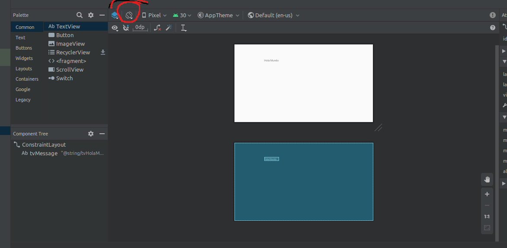
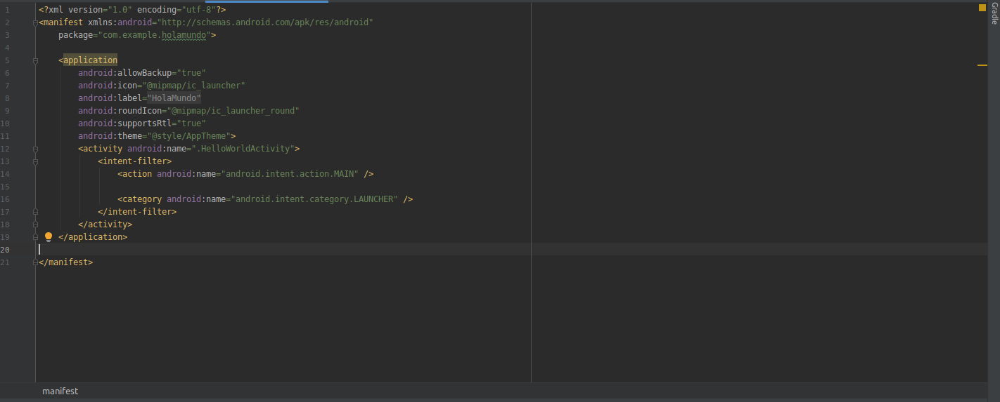
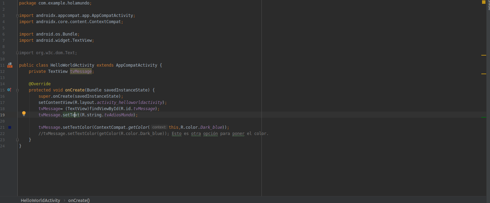

# HelloWorld
Se prueba diferentes elementos del entorno de desarrollo de android studio como el TextView y se comprende la organizacion de clases y carpetas como por ejemplo Manifiest.xml

## Tabla de contenido
* [Elementos gráficos](#Elementos-gráficos)
* [Opciones del entorno](#Opciones-del-entorno)
* [Biblioteca de clasess](#Biblioteca-de-clases)
* [Estado de la aplicación](#Estado-de-la-aplicación)

## Elementos gráficos
+ Text View : Se utilizó como primer elemento de texto donde se pudo modificar con el entorno de desarrollo añadiendo "Hola Mundo". También fue modificado en tiempo de ejecución para cuando corramos la aplicación el texto se cambie a "Adiós Mundo" y su texto cambie de color.

## Opciones del entorno
+ Translations Editor : Utilizado para añadir recursos de traducción al inglés. Detectando el idioma de nuestro dispositivo se utilizarán los recursos correspondientes.
+ New image asset : Utilizado para crear nuestro logo de la aplicación.
+ Cambiar la orientación de la aplicación; podiendo así modificar como queramos la distribución de nuestros elementos en la aplicación según la orientación

## Biblioteca de clases

+ Manifiest : Primer fichero en ejecutarse cuando se lanza la aplicación, el que define los parámetros que se utilizarán para su lanzamiento

+ Activity.Java : Contiene el código back-end para nuestra aplicación.

+ Recursos .xml : Todos los recursos estan almacenados en este fichero; imágenes, texto, icono de la aplicación...

## Estado de la aplicación
El proyecto se encuentra terminado al terminar la parte del temario básica correpondiente.
